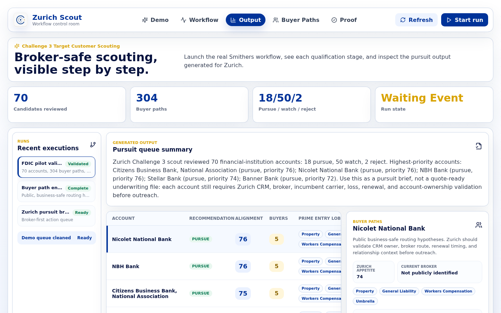

# Zurich Scout

Zurich Hyper Challenge 2026 Challenge 3 prototype by **Good Boys**.

Zurich Scout is an agentic target-customer scouting workflow for Zurich Insurance. It turns broad market white space into a broker-safe pursuit queue: which accounts to pursue now, which to watch, and which to reject before scarce distribution and underwriting time is spent.

- Demo video: [zurich-scout_good-boys.mp4](https://exploration.nbg1.your-objectstorage.com/zurich-scout_good-boys.mp4)
- Use case: `CI_Customer_Scouting_GoodBoys`
- Challenge: Target Customer Scouting
- Team: Good Boys

## Prototype Screens

### Demo Overview

The demo starts with the business result: 70 public targets were converted into 18 Zurich-ready pursuit candidates, 304 public buyer paths, and 0 artifact validation issues.


### Pursuit Queue

The pursuit queue shows each target's recommendation, Zurich alignment score, buyer count, likely entry lines of business, current broker status, and next Zurich validation action.



The current broker is intentionally shown as "Not publicly identified" unless Zurich internal data confirms it. Zurich Scout's job is to route the account into the right internal validation gate: CRM status, broker owner, incumbent carrier, renewal timing, loss history, and relationship owner.

### Buyer Paths

Buyer paths are public, business-safe routing hypotheses. They are not claims that the listed people are confirmed insurance buyers.


## What We Built

Zurich Scout has three connected tracks:

| Track | Purpose | Location |
| --- | --- | --- |
| Smithers workflow | Staged agent workflow for ICP definition, sourcing, triage, account research, quality review, buyer mapping, and pursuit brief assembly | `.smithers/workflows/challenge3-target-scout.tsx` |
| Workflow visualizer | Local React/Express demo app for the recorded walkthrough | `workflow-visualizer/` |
| Submission evidence | Decks, transcript, proof pack, generated artifact, screenshots, and validators | `deliverables/challenge3-target-customer-scouting/` |

The workflow is deliberately not a one-shot AI lead list. It is a qualification system. It downgrades weak accounts, records unknowns, caps buyer research, validates artifact structure, and keeps outreach behind Zurich review.

## Pilot Result

The submitted pilot is a focused FDIC Financial Institutions run, not the full D&B 30,000-company production run.

| Metric | Result |
| --- | ---: |
| Accounts reviewed | 70 |
| Public buyer / influencer paths mapped | 304 |
| Pursue | 18 |
| Watch | 50 |
| Reject | 2 |
| Artifact validation issues | 0 |

## Why It Is Built This Way

The case is not solved by finding more company names. Zurich already has relationships, past quotes, broker pipelines, CRM records, and underwriting expertise. The challenge is to identify which white-space accounts are worth human attention now.

That led to three design choices.

First, target scouting is treated as a staged workflow. Cheap broad triage happens before expensive deep research and buyer mapping.

Second, every pursue result is framed as an internal validation candidate, not a quote-ready lead. Zurich must still check broker-of-record, incumbent status, renewal timing, quote history, loss history, and account ownership.

Third, Zurich's proprietary data is the moat. Generic AI can research public company signals. Zurich wins when those public signals are overlaid with CRM, broker, quote, renewal, loss, appetite, and relationship data.

## Architecture

```mermaid
flowchart LR
  Universe["Public target universe\nFDIC pilot now, D&B 30k next"]
  ICP["Zurich ICP + disqualifiers"]
  Triage["Account triage"]
  Research["Deep account research"]
  Quality["Quality panel\nnegative evidence + unknowns"]
  Buyers["Buyer path mapping\npublic business-safe routes"]
  Brief["Pursuit brief\nstructured JSON + markdown"]
  Zurich["Zurich validation\nCRM, broker, quote, renewal, loss"]
  Activation["Guarded activation\nbroker ask, warm intro, CRM task"]

  Universe --> ICP --> Triage --> Research --> Quality --> Buyers --> Brief --> Zurich --> Activation
```



## Core Capabilities

- Define Zurich target profile, buyer personas, and disqualifiers.
- Source and triage candidate financial-institution accounts.
- Score Zurich appetite, pursuit priority, ICP fit, and evidence confidence.
- Infer likely entry lines of business from public evidence.
- Map public buyer and influencer paths.
- Surface negative evidence, risk flags, unknowns, and underwriting questions.
- Produce a structured pursuit queue with pursue/watch/reject discipline.
- Validate the final artifact for completeness and reviewability.

## Repository Layout

```text
zurich-scout-goodboys/
  .smithers/
    workflows/challenge3-target-scout.tsx      # Core staged workflow
    scripts/                                   # Repair and validation helpers
    data/challenge3-fdic-seeds.json            # Pilot seed universe
  deliverables/
    challenge3-target-customer-scouting/
      deck/                                    # Executive summary and 3-slide deck
      prototype-evidence/                      # Full generated JSON/Markdown artifact
      readme-assets/                           # Screenshots used in docs
      technical-summary/                       # Technical summary PDFs/Markdown
      validation/                              # Proof pack
      video/                                   # Transcript and recording note
  workflow-visualizer/                         # Local demo app
  scripts/
    validate_challenge3_package.mjs            # Portable artifact validator
```

## Submission Files

| Deliverable | File |
| --- | --- |
| Demo video | [External MP4](https://exploration.nbg1.your-objectstorage.com/zurich-scout_good-boys.mp4) |
| Transcript | [`deliverables/challenge3-target-customer-scouting/video/GoodBoys_TargetCustomerScouting_transcript.md`](deliverables/challenge3-target-customer-scouting/video/GoodBoys_TargetCustomerScouting_transcript.md) |
| Executive summary | [`deliverables/challenge3-target-customer-scouting/deck/GoodBoys_TargetCustomerScouting_executive_summary.pdf`](deliverables/challenge3-target-customer-scouting/deck/GoodBoys_TargetCustomerScouting_executive_summary.pdf) |
| 3-slide pitch deck | [`deliverables/challenge3-target-customer-scouting/deck/GoodBoys_TargetCustomerScouting_pitch_deck.pdf`](deliverables/challenge3-target-customer-scouting/deck/GoodBoys_TargetCustomerScouting_pitch_deck.pdf) |
| Technical summary | [`deliverables/challenge3-target-customer-scouting/technical-summary/GoodBoys_TargetCustomerScouting_technical_summary.pdf`](deliverables/challenge3-target-customer-scouting/technical-summary/GoodBoys_TargetCustomerScouting_technical_summary.pdf) |
| Proof pack | [`deliverables/challenge3-target-customer-scouting/validation/GoodBoys_ZurichScout_proof_pack.md`](deliverables/challenge3-target-customer-scouting/validation/GoodBoys_ZurichScout_proof_pack.md) |
| Full generated artifact | [`deliverables/challenge3-target-customer-scouting/prototype-evidence/latest.json`](deliverables/challenge3-target-customer-scouting/prototype-evidence/latest.json) |
| Human-readable generated artifact | [`deliverables/challenge3-target-customer-scouting/prototype-evidence/latest.md`](deliverables/challenge3-target-customer-scouting/prototype-evidence/latest.md) |

## Reports And Evidence Index

The repo intentionally keeps the written work visible. These are the main report families:

| Report family | What it contains | Location |
| --- | --- | --- |
| Submission strategy | Deliverable checklist, winning strategy, judge framing, and planning notes | [`deliverables/challenge3-target-customer-scouting/00-submission-checklist-and-winning-strategy.md`](deliverables/challenge3-target-customer-scouting/00-submission-checklist-and-winning-strategy.md) |
| Video plan and transcript | Original demo plan, final transcript, storyboard backup, and MP4 recording note | [`deliverables/challenge3-target-customer-scouting/video/`](deliverables/challenge3-target-customer-scouting/video/) |
| Deck and executive summary | Final PDFs, markdown backups, cover, rendered slide images, screenshots, and content critique | [`deliverables/challenge3-target-customer-scouting/deck/`](deliverables/challenge3-target-customer-scouting/deck/) and [`deliverables/challenge3-target-customer-scouting/imagegen-slides/`](deliverables/challenge3-target-customer-scouting/imagegen-slides/) |
| Technical report | Visual one-pager plus detailed technical summary | [`deliverables/challenge3-target-customer-scouting/technical-summary/`](deliverables/challenge3-target-customer-scouting/technical-summary/) |
| Proof pack | Validation evidence, review boundaries, and audit notes | [`deliverables/challenge3-target-customer-scouting/validation/GoodBoys_ZurichScout_proof_pack.md`](deliverables/challenge3-target-customer-scouting/validation/GoodBoys_ZurichScout_proof_pack.md) |
| Full generated artifact | Complete account research, ranked queue, buyer paths, unknowns, sources, and underwriting questions | [`deliverables/challenge3-target-customer-scouting/prototype-evidence/latest.md`](deliverables/challenge3-target-customer-scouting/prototype-evidence/latest.md) and [`latest.json`](deliverables/challenge3-target-customer-scouting/prototype-evidence/latest.json) |
| Historical Smithers outputs | Intermediate generated pursuit briefs and repaired final artifact | [`.smithers/outputs/challenge3-target-scout/`](.smithers/outputs/challenge3-target-scout/) |
| Public HTML reports | Browser-rendered pitch, executive summary, and business report pages | [`public/`](public/) |
| Case source notes | AMA/case notes used to understand the challenge | [`resources/`](resources/) |
| Brand work | Selected icon, branding guide, icon concepts, and generation brief | [`deliverables/challenge3-target-customer-scouting/brand/`](deliverables/challenge3-target-customer-scouting/brand/), [`branding-guide/`](deliverables/challenge3-target-customer-scouting/branding-guide/), [`icon-concepts/`](deliverables/challenge3-target-customer-scouting/icon-concepts/) |
| Render/package scripts | Scripts used to render slides, package submission assets, and validate artifacts | [`scripts/`](scripts/) |

## Running The Demo Locally

The demo app is optional for review because the MP4 and submission artifacts are included. To run it locally:

```bash
cd workflow-visualizer
npm install
npm run build
PORT=5179 HOST=0.0.0.0 npm start
```

Then open:

```text
http://127.0.0.1:5179
```

## Verification

Validate the generated artifact:

```bash
node scripts/validate_challenge3_package.mjs \
  deliverables/challenge3-target-customer-scouting/prototype-evidence/latest.json
```

Expected result:

```json
{
  "companies": 70,
  "buyers": 304,
  "recommendationCounts": {
    "pursue": 18,
    "watch": 50,
    "reject": 2
  },
  "issueCount": 0,
  "issues": []
}
```

Build the visualizer:

```bash
cd workflow-visualizer
npm run build
```

## Boundaries And Controls

- Zurich Scout does not autonomously contact buyers.
- Buyer paths are public, business-safe routing hypotheses.
- Current broker is not inferred from public data when not supported.
- Pursue means "worth Zurich internal validation now," not "quote-ready."
- Zurich internal data is required before activation: CRM status, broker owner, incumbent carrier, renewal timing, quote history, loss history, and relationship owner.

## Team

Good Boys:

- Ralf Boltshauser, `ralf@boltshauser.com`
- Marco Pagano, `marcopagano2003@hotmail.com`
- Samuel Huber, `samuel@dtech.vision`
