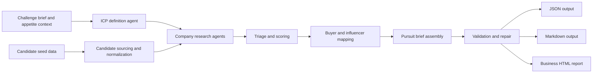
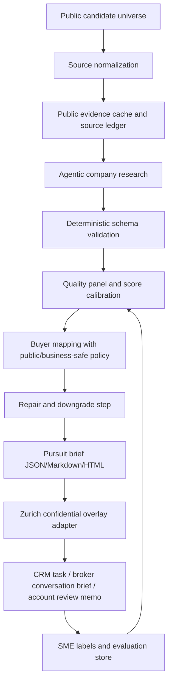
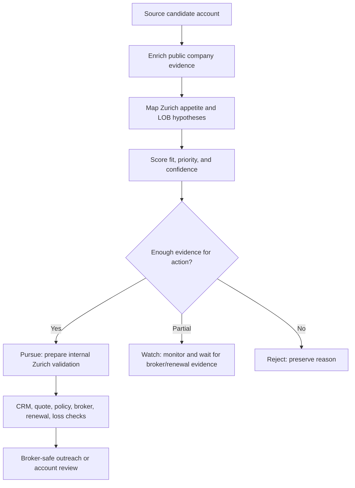

# Deliverable 3 Plan: Technical Summary Document

## Required Output

The technical summary can be submitted as Markdown. It must cover:

- What we built.
- System design and component-level diagrams.
- Technology stack.
- How we built it.
- Implementation approach, methodology, workflows, and integrations.
- How we control and evaluate it.
- Monitoring, performance, outputs, known risks.
- Learnings.
- Cost drivers and running-cost estimate.
- Process design map.
- GitHub repository link.

## Hackathon Guide Constraints

- The technical summary must justify what is shown in the pitch and demo; avoid documenting unused complexity.
- Keep a stable, reproducible version ready hours before the deadline.
- Technical proof should be deterministic: fixed artifact paths, fixed validation command, fixed output numbers.
- The summary must help the technical SME rationalize the emotional business story: this is controlled, explainable, auditable, and scalable.
- Do not add new technical features in final hours unless they appear in the demo or directly reduce submission risk.

## Technical Summary Structure

1. Executive technical overview.
2. Business problem translated into system requirements.
3. Architecture.
4. Agent workflow.
5. Data model and outputs.
6. Evaluation and controls.
7. Security, privacy, and compliance posture.
8. Cost and scalability.
9. Known risks and limitations.
10. Implementation details and reproducibility.
11. Learnings and next iteration.

## What We Built

An agentic target-scouting workflow for Zurich's US middle-market financial-institution opportunity search.

Inputs:

- Challenge-three AMA guidance.
- Zurich FI appetite/playbook materials available in the repo.
- FDIC/company seed data.
- Public company, regulatory, event, and people signals gathered by agents.

Outputs:

- `latest.json`: structured machine-readable pursuit brief.
- `latest.md`: human-readable ranked account brief.
- `public/challenge3-zurich-business-report.html`: executive report.
- Account-level recommendations: pursue, watch, reject.
- Buyer paths and business-safe outreach angles.
- Zurich validation gates before external action.

Current validated artifact:

- Run ID: `2ccc8e23-2178-4e37-be14-34392288217d`.
- Workflow: `.smithers/workflows/challenge3-target-scout.tsx`.
- Workflow hash observed in run logs: `ba8b05a60740b314d353d4cd6411d4a3d3901a67219ee84b9a5958824175fce9`.
- Final outputs:
  - `.smithers/outputs/challenge3-target-scout/latest.json`.
  - `.smithers/outputs/challenge3-target-scout/latest.md`.
  - `public/challenge3-zurich-business-report.html`.
- Validation command run locally:

```bash
bun .smithers/scripts/validate-challenge3-output.ts .smithers/outputs/challenge3-target-scout/latest.json
```

- Validation result:

```json
{
  "companies": 70,
  "buyers": 304,
  "recommendationCounts": {
    "pursue": 18,
    "watch": 50,
    "reject": 2
  },
  "markdownChars": 1056858,
  "issueCount": 0,
  "issues": []
}
```

## System Design Diagram

Use Mermaid:



Add a control-point architecture diagram:



## Process Design Map

Use Mermaid:



## Technology Stack

- Smithers workflow orchestration.
- TypeScript workflow and validation scripts.
- Markdown and JSON artifacts.
- HTML/CSS business report.
- Public web/company research performed by agent tasks.
- Local repository outputs for reproducibility.

## Reproducibility Plan

Install and verify Smithers package:

```bash
cd /home/ralf/prj/hackathons/hyperchallenge-zurich-insurance/.smithers
bun install
bun run typecheck
```

Replay smoke-test mode:

```bash
cd /home/ralf/prj/hackathons/hyperchallenge-zurich-insurance/.smithers
bun run workflow:run challenge3-target-scout --input '{"targetVertical":"US middle-market financial institutions","maxCompanies":2,"maxPeoplePerCompany":3,"companyConcurrency":2,"qualityConcurrency":2,"buyerMapConcurrency":2,"personConcurrency":3,"reviewIcp":false}'
```

Submitted 70-account run:

- The workflow default is intentionally small: `maxCompanies: 2`, which is the smoke-test mode.
- The submitted run is a larger persisted run, not the default.
- Preserve this submitted run configuration in the final technical summary:

```json
{
  "prompt": "70-company Zurich Challenge 3 GTM scout for hack-case submission. Continue from persisted company research; do not redo completed company work. Produce underwriter-safe, sales-actionable pursuit briefs. Strict calibration: pursue means active Zurich sales/distribution validation now; watch means ICP-relevant but conditional, buyer-research-only, or missing broker/renewal/white-space evidence; reject means outside ICP or insufficient evidence. Tie every important claim to public evidence, state negative evidence and unknowns, and keep contact research public/business-safe.",
  "targetVertical": "US middle-market financial institutions",
  "maxCompanies": 70,
  "maxPeoplePerCompany": 5,
  "companyConcurrency": 10,
  "qualityConcurrency": 10,
  "buyerMapConcurrency": 10,
  "personConcurrency": 12,
  "reviewIcp": false
}
```

Validation:

```bash
cd /home/ralf/prj/hackathons/hyperchallenge-zurich-insurance
bun .smithers/scripts/validate-challenge3-output.ts .smithers/outputs/challenge3-target-scout/latest.json
```

Expected output paths:

- `.smithers/outputs/challenge3-target-scout/latest.json`
- `.smithers/outputs/challenge3-target-scout/latest.md`
- `.smithers/outputs/challenge3-target-scout/pursuit-brief-*.json`
- `.smithers/outputs/challenge3-target-scout/pursuit-brief-*.md`

Runtime/cost note:

- Final technical summary should report actual elapsed time and token/cost estimate from Smithers logs if available.
- If exact cost cannot be recovered, report conservative cost drivers and avoid a false exact number.

Demo-stability rule:

- The final demo should not depend on live external research.
- Use persisted artifacts and validation output.
- Keep a reset/reopen checklist:
  - Open business report.
  - Open `latest.md`.
  - Open terminal validation output.
  - Show one pursue, one watch, one reject.
  - Show internal-overlay mock if implemented.

## Agent Workflow

Document the workflow stages:

- Define ICP.
- Source candidates.
- Deep company research.
- Triage candidates.
- Company quality panel.
- Buyer map.
- Deep person research.
- Assemble pursuit brief.
- Validate and repair artifact.

Explain the repair step as governance:

- `.smithers/scripts/repair-challenge3-artifact.ts` deduplicates buyers, caps buyers per account, and downgrades accounts without verified buyer paths.
- This is not cosmetic cleanup; it prevents optimistic sales claims from surviving into the final artifact.

Explain why this is agentic:

- The system decomposes a complex business-research task into specialized reasoning steps.
- Each step produces structured intermediate outputs.
- Later steps use prior evidence and quality gates.
- The workflow downgrades or rejects weak evidence rather than hallucinating actionability.

## Evaluation And Controls

Controls to document:

- Required evidence for recommendation.
- Distinct scores for appetite, priority, and confidence.
- Recommendation classes: pursue, watch, reject.
- Unknowns and internal validation gates required for every pursuit.
- Public/business-safe buyer-route policy.
- Validation script for final artifact.
- Manual review of top accounts.
- Negative controls: show at least one reject and one watch account to prove the system suppresses weak opportunities.

Evaluation plan:

- Completeness: all required output fields exist.
- Plausibility: top accounts have concrete why-now triggers.
- Explainability: recommendation links to evidence and unknowns.
- Precision proxy: pursue accounts should survive Zurich internal clearance more often than watch accounts.
- Business usefulness: Zurich SMEs rate each account on "would I spend the next hour on this?"
- Source liveness: sampled source URLs still resolve.
- Buyer verification: buyer role is supported by official/company/credible public sources.
- High-confidence/no-source check: high-confidence claims must have sources unless explicitly marked as Zurich-only unknowns.
- Recommendation-score consistency: `pursue` should require sufficient pursuit priority, appetite, and evidence confidence.
- Entity resolution: duplicate entities, parent/subsidiary confusion, and name collisions are flagged.
- Manual audit: sample 10 accounts and 5 claims per account.
- SME label sheet: `would pursue`, `would not pursue`, `needs more data`, reason, and confidence.
- Business metrics: SME acceptance rate, false-positive reasons, broker-route validation rate, time-to-brief, and internal-clearance pass rate.

Human validation sprint artifact:

- Create a lightweight review sheet with:
  - Account name.
  - Current recommendation.
  - Distribution/broker proxy score.
  - Underwriting/risk proxy score.
  - Buyer/procurement proxy score.
  - Missing data.
  - Final adjustment.
- Include it in the technical summary as a planned evaluator loop, or as evidence if completed before submission.

## Scoring Rubric

| Score | Inputs | Calibration |
| --- | --- | --- |
| `icpFit` | Segment, SIC/NAICS, US middle-market profile, geography, account type | High when the company clearly matches Zurich FI appetite and is not an obvious Fortune 500-only account |
| `zurichAppetite` | Zurich playbook alignment, disqualifiers, authority threshold, LOB fit | Lower when CAT, property quality, regulatory, fleet, OREO, or other controls are unknown or adverse |
| `pursuitPriority` | Why-now trigger, size, buyer path, broker route, renewal likelihood, white-space hypothesis | `pursue` only when a human validation action is justified now |
| `evidenceConfidence` | Source count, source quality, recency, source independence, contradiction penalty | High only with multiple credible sources and no unresolved contradictions |

Recommendation thresholds:

- `pursue`: strong ICP/appetite fit, credible why-now trigger, plausible buyer or distribution route, and enough evidence for Zurich internal validation.
- `watch`: ICP-relevant but missing broker, renewal, buyer, control, or white-space evidence.
- `reject`: outside ICP, weak evidence, likely unsuitable size/ownership, or disqualifiers dominate.

## Evidence Ledger Requirement

Every top pursuit account should include:

- At least 3 independent source-backed facts.
- Source URLs.
- Source type: company, regulator, filing, news, association/event, broker/distribution clue, or other.
- Source authority tier: official/regulator, company primary, credible third party, weak/needs confirmation.
- Source retrieval date where available.
- Clear separation:
  - Public facts.
  - Model inferences.
  - Unknowns that require Zurich internal data.
- Dead-link policy: preserve source title/date/snippet where possible and downgrade confidence if the source cannot be re-opened.
- Disputed-source policy: record contradiction, lower confidence, and avoid `pursue` unless the contradiction is not material.

## Data Model Table

| Entity | Purpose | Key Fields |
| --- | --- | --- |
| `SeedCompany` | Optional provided starting account | `name`, `website`, `notes` |
| `CandidateCompany` | Raw sourced account | `name`, `website`, `headquarters`, `subsegment`, `likelySic`, `sourceUrls`, `discoveryRationale` |
| `CandidateTriage` | First-pass ranking | `triageScore`, `triageRationale`, `evidenceConfidence`, `priorityReason` |
| `CompanyProfile` | Researched account profile | `scores`, `recommendation`, `rationale`, `sicRationale`, `whyNow`, evidence arrays, risks, actions |
| `QualifiedCompany` | Quality-reviewed profile | `qualityReview.approvedForBuyerResearch`, `strongestEvidence`, `weakestEvidence`, `forcedCorrections` |
| `BuyerCandidate` | Candidate decision-maker | `name`, `role`, `priority`, `relevanceRationale`, `sourceUrls` |
| `EnrichedBuyer` | Public/business-safe buyer route | `businessContactPaths`, `warmIntroHypotheses`, `personalizedOutreachAngle`, `confidence` |
| `PursuitBrief` | Final artifact | `executiveSummary`, `icp`, `companies`, `markdownBrief` |

## Run Metadata To Add Before Final Submission

The final artifact should preserve:

- `generated_at`.
- Workflow path and workflow hash.
- Run ID.
- Input config.
- Prompt hash.
- Model/agent family where available.
- Source snapshot ID or evidence-ledger version.
- Validation script version.
- Cost or token estimate.
- Repair-step status.

## Scalability And Cost

Cost drivers:

- Number of accounts researched.
- Depth of public-company research per account.
- Number of buyer/person profiles per account.
- Refresh frequency.
- Whether internal Zurich data joins are batch or interactive.

Cost-control design:

- Batch triage before deep research.
- Cache company research.
- Cap buyer profiles.
- Use cheaper deterministic validation for schema checks.
- Use human review only for top pursue accounts.

Scaling path:

- Run broad universe in shallow mode.
- Deep-research only top candidates.
- Integrate Zurich CRM and D&B as structured sources.
- Store evidence snapshots and refresh only changed accounts.

Suggested production-scale pattern:

- 30,000 D&B accounts: shallow deterministic/cheap triage.
- Top 500: deep company research.
- Top 100: buyer/distribution mapping.
- Top 25: Zurich SME review.
- Refresh cadence: monthly for high-priority watch accounts, quarterly for the wider universe, event-triggered for M&A/leadership/regulatory signals.
- Cost reporting: estimate per 100 accounts, then extrapolate to 30,000 with staged filtering rather than deep-researching all accounts.

## Known Risks

- Public data may be stale or incomplete.
- Buyer names/roles may change.
- Zurich confidential data is required for real clearance.
- Appetite mapping should be replaced with official Zurich SIC-level appetite rules.
- Automated outreach could create reputational risk if used without broker ownership checks.
- Financial-institution focus may need adaptation for other industry groups.

## Out-Of-The-Box Technical Enhancements

- Add an "internal Zurich overlay adapter" with mocked fields now and real connectors later:
  - Existing customer match.
  - Prior quote/lost opportunity.
  - Broker of record.
  - Renewal date.
  - Claim/loss signals.
  - Appetite authority threshold.
- Add a stakeholder UI where an underwriter can accept/reject recommendation rationales.
- Add eval labels from Zurich SMEs and retrain/recalibrate scoring.
- Add CRM export format so outputs can become tasks, notes, or opportunity records.
- Add a "why not pursue" explanation to prevent sales pressure from overriding weak evidence.
- Add a simple review sheet or UI:
  - Accept recommendation?
  - Correct SIC/appetite?
  - Buyer credible?
  - Broker route known?
  - Pursue next action?
  - Reviewer confidence.

## Perfect Deliverable Checklist

- Clear diagrams are included.
- Every system claim maps to a repo artifact or workflow stage.
- Architecture is understandable to a technical SME in 2 minutes.
- Evaluation is credible even without Zurich confidential data.
- Risks are explicit and mature.
- Cost/scalability section is practical.
- GitHub link and run instructions are present.
- The summary explains only features that are actually in the artifact, demo, or explicit next-step plan.
- The final validation command has been run after the last artifact change.
