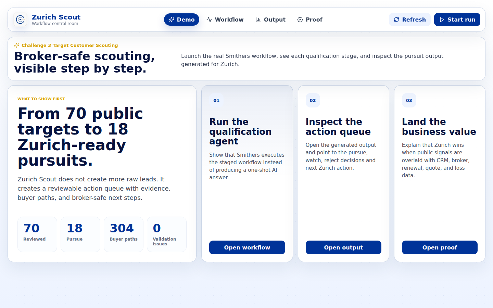
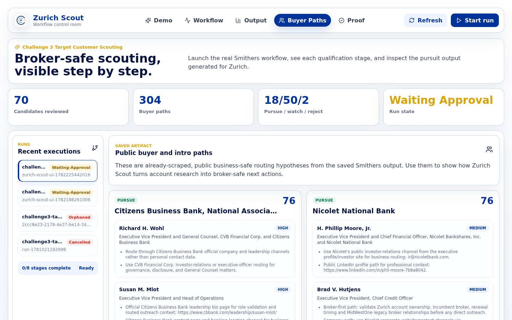

# Zurich Scout - Good Boys Challenge 3 Submission

Use case: `CI_Customer_Scouting_GoodBoys`  
Challenge: Zurich Hyper Challenge 2026 - Challenge 3, Target Customer Scouting  
Team: Good Boys  
Solution: Zurich Scout

Zurich Scout is an agentic customer-scouting workflow for Zurich. It turns a broad white-space target universe into a broker-safe action queue: pursue, watch, or reject. The core idea is not "more leads." The core idea is better pursuit decisions before scarce distribution and underwriting time is spent.

## Submission Path

1. Walkthrough video: [zurich-scout_good-boys.mp4](https://exploration.nbg1.your-objectstorage.com/zurich-scout_good-boys.mp4)
2. Read the one-page summary: [`deck/GoodBoys_TargetCustomerScouting_executive_summary.pdf`](deck/GoodBoys_TargetCustomerScouting_executive_summary.pdf)
3. Review the 3-slide deck: [`deck/GoodBoys_TargetCustomerScouting_pitch_deck.pdf`](deck/GoodBoys_TargetCustomerScouting_pitch_deck.pdf)
4. Check the technical one-pager: [`technical-summary/GoodBoys_TargetCustomerScouting_technical_summary.pdf`](technical-summary/GoodBoys_TargetCustomerScouting_technical_summary.pdf)
5. Inspect the validation evidence: [`validation/GoodBoys_ZurichScout_proof_pack.md`](validation/GoodBoys_ZurichScout_proof_pack.md)
6. Open the full generated artifact if needed: [`prototype-evidence/latest.md`](prototype-evidence/latest.md)

The MP4 is intentionally hosted externally because it is larger than GitHub's normal file limit. The transcript is included in this repository.

## What We Built

Zurich Scout runs a gated Smithers workflow:

1. Define Zurich ICP and disqualifiers.
2. Source candidate accounts.
3. Triage the broad universe.
4. Deep-research qualified accounts.
5. Run quality checks and surface unknowns.
6. Map public buyer and influencer paths.
7. Research people and business-safe contact routes.
8. Assemble a Zurich pursuit brief.

The output is not a quote-ready underwriting file. It is an internal validation queue. Each pursue account still needs Zurich CRM, broker-of-record, incumbent carrier, renewal timing, loss history, and relationship-owner validation before outreach.

## Pilot Result

The validated FDIC Financial Institutions pilot produced:

| Metric | Result |
| --- | ---: |
| Accounts reviewed | 70 |
| Public buyer / influencer paths | 304 |
| Pursue | 18 |
| Watch | 50 |
| Reject | 2 |
| Artifact validation issues | 0 |

## Prototype Screens

### Demo Overview



### Pursuit Queue With Zurich Appetite And Entry Lines


The output screen sorts targets by a combined alignment score based on Zurich appetite, pursuit priority, and evidence confidence from the saved artifact. It also shows likely entry lines of business such as Property, General Liability, Workers Compensation, Umbrella, Financial Lines, Cyber, Claims/Risk Engineering, and International where supported by the account evidence.

Current broker is intentionally shown as "Not publicly identified" unless Zurich internal data confirms it. That is the point of the next validation gate: check broker ownership, incumbent status, prior quote history, renewal timing, loss history, and CRM ownership before activation.

### Buyer Paths



Buyer paths are public, business-safe routing hypotheses. They are not claims that the listed people are confirmed insurance buyers. Zurich should use them as a starting point for CRM review, broker validation, relationship mapping, and warm-intro discovery.

## Submission Files

| Deliverable | File |
| --- | --- |
| Prototype walkthrough MP4 | [External video](https://exploration.nbg1.your-objectstorage.com/zurich-scout_good-boys.mp4) |
| Transcript | [`video/GoodBoys_TargetCustomerScouting_transcript.md`](video/GoodBoys_TargetCustomerScouting_transcript.md) |
| One-page executive summary | [`deck/GoodBoys_TargetCustomerScouting_executive_summary.pdf`](deck/GoodBoys_TargetCustomerScouting_executive_summary.pdf) |
| Executive summary text backup | [`deck/GoodBoys_TargetCustomerScouting_executive_summary.md`](deck/GoodBoys_TargetCustomerScouting_executive_summary.md) |
| Pitch deck, 3 slides | [`deck/GoodBoys_TargetCustomerScouting_pitch_deck.pdf`](deck/GoodBoys_TargetCustomerScouting_pitch_deck.pdf) |
| Technical summary visual one-pager | [`technical-summary/GoodBoys_TargetCustomerScouting_technical_summary.pdf`](technical-summary/GoodBoys_TargetCustomerScouting_technical_summary.pdf) |
| Technical summary detailed backup | [`technical-summary/GoodBoys_TargetCustomerScouting_technical_summary.md`](technical-summary/GoodBoys_TargetCustomerScouting_technical_summary.md) |
| Proof pack | [`validation/GoodBoys_ZurichScout_proof_pack.md`](validation/GoodBoys_ZurichScout_proof_pack.md) |
| Full generated artifact | [`prototype-evidence/latest.json`](prototype-evidence/latest.json) |
| Human-readable generated artifact | [`prototype-evidence/latest.md`](prototype-evidence/latest.md) |
| Validator | [`prototype-evidence/validate-submission-output.mjs`](prototype-evidence/validate-submission-output.mjs) |

## Validate The Artifact

Run this from the repository root:

```bash
node scripts/validate_challenge3_package.mjs .smithers/outputs/challenge3-target-scout/latest.json
```

Or run it against the copied submission evidence:

```bash
node deliverables/challenge3-target-customer-scouting/prototype-evidence/validate-submission-output.mjs \
  deliverables/challenge3-target-customer-scouting/prototype-evidence/latest.json
```

Expected result:

```json
{
  "companies": 70,
  "buyers": 304,
  "recommendationCounts": {
    "pursue": 18,
    "watch": 50,
    "reject": 2
  },
  "issueCount": 0,
  "issues": []
}
```

## Business Value For Zurich

Zurich Scout creates value in two ways:

1. It reduces wasted expert time by suppressing weak accounts before they reach distribution and underwriting review.
2. It makes public target scouting defensible once Zurich overlays proprietary data: CRM history, broker owner, quote history, renewal date, loss history, relationship owner, and appetite class.

The strongest production path is to run the same workflow over the D&B 30,000-company universe, deep-research the highest-scoring accounts, and then let Zurich teams review the top 25 with internal relationship context.

## Pilot Boundary

This is a focused FDIC Financial Institutions pilot, not the full D&B 30,000-company production run. The evidence proves the workflow shape, artifact completeness, and reviewability. It does not prove Zurich appetite truth, broker ownership, renewal timing, buyer authority, or opportunity quality. Those require Zurich internal data and SME review.
