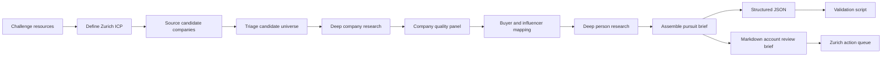
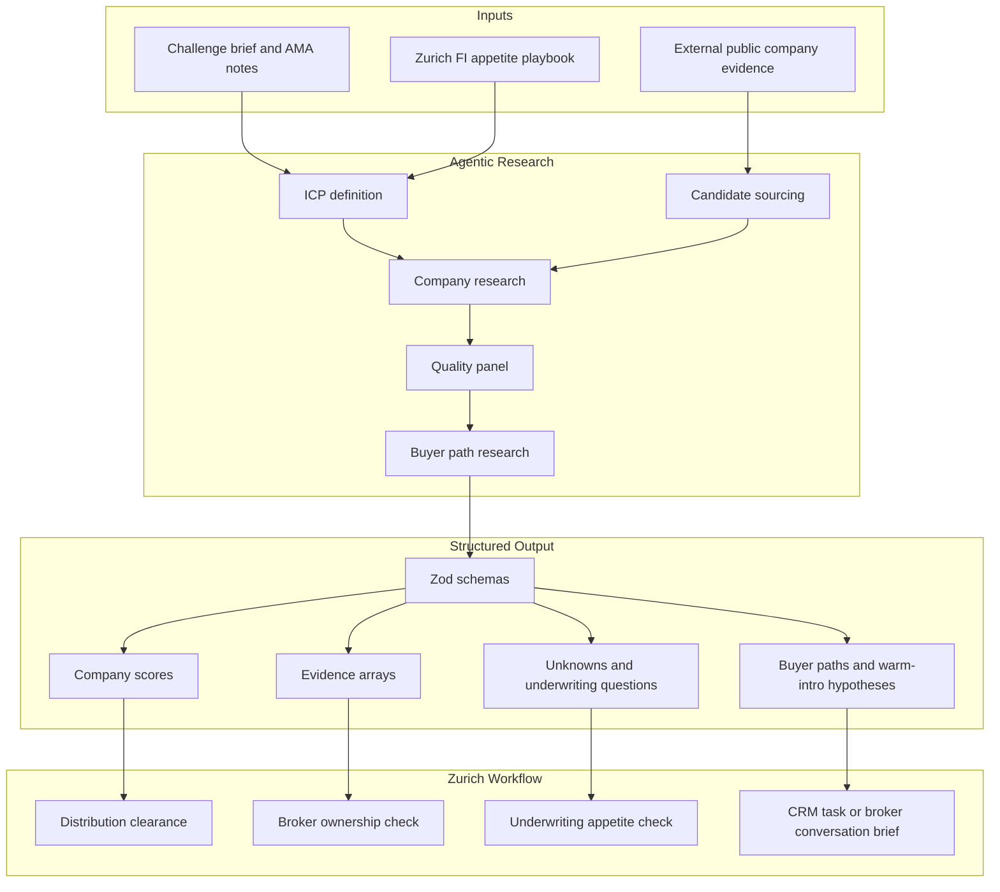

# Good Boys - Zurich Scout Technical Summary

## Overview

Zurich Scout is an agentic target-scouting workflow for Zurich's Challenge 3: Target Customer Scouting. It identifies US middle-market accounts that may fit Zurich appetite, researches evidence and risks, maps public buyer paths, and produces a structured pursuit brief for Zurich internal validation.

The prototype was run on a focused pilot vertical: US middle-market financial institutions. This was chosen because Zurich provided Financial Institutions appetite material, the vertical has clear multiline insurance relevance, and public evidence is available for account-level validation.

Scope boundary: this is an FDIC Financial Institutions pilot. It is not the full Zurich D&B 30,000-company run. The next production pilot should run the same staged workflow against the D&B universe and Zurich internal overlays.

## What We Built

The system produces two synchronized outputs:

- Structured JSON for validation, scoring, integration, and repeatability.
- Human-readable Markdown for business users, distribution leaders, underwriters, and technical evaluators.
- Submission-facing proof artifacts: executive summary PDF, three-slide pitch deck, proof pack, transcript, and storyboard frames for the recorded walkthrough.

The final run created:

| Output | Result |
| --- | ---: |
| Accounts reviewed | 70 |
| Buyer and influencer paths | 304 |
| Pursue recommendations | 18 |
| Watch recommendations | 50 |
| Reject recommendations | 2 |
| Validation issues | 0 |

Important boundary: the output is a **Zurich internal validation queue**, not a quote recommendation and not an autonomous outreach engine. A `pursue` account means "worth Zurich clearance now."

## System Design



## Component-Level Design



## Workflow Components

The Smithers workflow is implemented in `.smithers/workflows/challenge3-target-scout.tsx`.

It runs these components:

| Component | Purpose |
| --- | --- |
| `DefineIcp` | Reads challenge resources and defines Zurich-relevant target criteria. |
| `SourceCandidates` | Builds the candidate account universe. |
| `TriageCandidates` | Selects the highest-potential accounts for deeper research. |
| `DeepCompanyResearch` | Gathers company-level evidence, risks, triggers, and source URLs. |
| `CompanyQualityPanel` | Scores and calibrates account quality. |
| `BuyerMap` | Finds plausible public buyer and influencer paths. |
| `DeepPersonResearch` | Enriches buyer paths with business-safe evidence. |
| `AssemblePursuitBrief` | Produces the final ranked account queue and account briefs. |

## Implementation Approach

The implementation uses a staged "wide then deep" pattern:

1. Read the challenge and appetite materials to define the target customer profile.
2. Build a candidate universe from external sources.
3. Triage the universe before spending deeper research effort.
4. Research selected companies into structured evidence, risks, unknowns, and line-of-business hypotheses.
5. Run a quality panel that can downgrade accounts before buyer research.
6. Enrich buyer and influencer paths only for accounts that survive quality gates.
7. Assemble a final pursuit brief and validate it against the schema and quality rules.

This pattern is intentionally cost-aware: buyer research and long-form account briefs happen after account-level qualification, not before.

## Reproducibility Appendix

Known successful run:

- Smithers run ID: `2ccc8e23-2178-4e37-be14-34392288217d`
- Target vertical: `US middle-market financial institutions`
- Seed source: `.smithers/data/challenge3-fdic-seeds.json`
- Reviewed companies in final artifact: 70
- Node version in current workspace: `v26.2.0`
- Bun version in current workspace: `1.3.14`

Current artifact hashes:

```text
02879286d02724143d4b5657aa2f76338a3a8a3bdb4660e85097c5fb319176ef  .smithers/workflows/challenge3-target-scout.tsx
4a612f0d85d917c2eeceade9b8d19ecfdfa8ed9d7716854beb7f9bee3c5d33d1  .smithers/components/gtm/schemas.ts
fe393964f152f35ef095df3defc80665847ac5176eb581c35e5805d08e0bdff2  .smithers/scripts/validate-challenge3-output.ts
```

Representative run payload for the 70-account pilot:

```json
{
  "prompt": "70-company Zurich Challenge 3 GTM scout for hack-case submission. Continue from persisted company research; do not redo completed company work. Produce underwriter-safe, sales-actionable pursuit briefs. Strict calibration: pursue means active Zurich sales/distribution validation now; watch means ICP-relevant but conditional, buyer-research-only, or missing broker/renewal/white-space evidence; reject means outside ICP or insufficient evidence. Tie every important claim to public evidence, state negative evidence and unknowns, and keep contact research public/business-safe.",
  "targetVertical": "US middle-market financial institutions",
  "maxCompanies": 70,
  "maxPeoplePerCompany": 5,
  "companyConcurrency": 6,
  "qualityConcurrency": 6,
  "buyerMapConcurrency": 6,
  "personConcurrency": 12,
  "reviewIcp": false
}
```

Local Smithers validator command:

```bash
bun .smithers/scripts/validate-challenge3-output.ts .smithers/outputs/challenge3-target-scout/latest.json
```

Portable package validator command from the extracted submission zip:

```bash
node prototype-evidence/validate-submission-output.mjs prototype-evidence/latest.json
```

## Data Inputs

The prototype used:

- Zurich hackathon case materials.
- Challenge 3 AMA summary and transcript.
- Zurich North America Middle Markets Financial Institutions playbook.
- Public web evidence for companies, filings, regulatory records, news, executive pages, and public profiles.

For production adoption, the system should add Zurich-controlled data:

- Existing customer match.
- Prior quote or declination.
- Broker owner.
- Renewal date.
- Loss-history flag.
- Relationship owner.
- Appetite class and underwriting notes.

## Scoring And Recommendations

Each account is scored across fit, appetite, timing, evidence quality, and actionability. The recommendation language is intentionally conservative:

| Recommendation | Meaning |
| --- | --- |
| `pursue` | Worth immediate Zurich internal validation. Not quote-ready. |
| `watch` | Fits the profile, but timing, broker path, renewal evidence, loss history, or risk data is insufficient. |
| `reject` | Outside the current ICP or too weak for Zurich attention. |

This prevents the workflow from turning every researched company into a sales action.

## Controls And Evaluation

The local validation script is `.smithers/scripts/validate-challenge3-output.ts`. The submission zip also includes a self-contained portable validator at `prototype-evidence/validate-submission-output.mjs`, so the artifact checks can run without the full Smithers source tree.

It checks that:

- The output contains companies.
- The Markdown brief is substantial.
- The portfolio dashboard exists.
- The Zurich action queue exists.
- Each qualified company has source-supported evidence, negative evidence, unknowns, and open underwriting questions.
- Buyer paths have source URLs, public profiles, business contact paths, and meaningful outreach angles.
- Buyer counts remain capped.
- `pursue` recommendations meet minimum priority discipline.

The final run passed with zero issues.

Local validation command:

```bash
bun .smithers/scripts/validate-challenge3-output.ts .smithers/outputs/challenge3-target-scout/latest.json
```

Portable package validation command:

```bash
node prototype-evidence/validate-submission-output.mjs prototype-evidence/latest.json
```

Validated result:

```json
{
  "companies": 70,
  "buyers": 304,
  "recommendationCounts": {
    "pursue": 18,
    "watch": 50,
    "reject": 2
  },
  "issueCount": 0,
  "issues": []
}
```

Additional controls designed into the schemas:

- Every evidence item is tagged as fact, inference, unknown, or recommended action.
- Company scores are bounded from 0 to 100.
- Recommendations are limited to `pursue`, `watch`, or `reject`.
- Buyers are priority ranked from 1 to 5 and must carry source support.
- Warm-intro hypotheses are separated from confirmed contact paths.

What this evaluation does not prove:

- It does not verify every source URL or every public claim.
- It does not prove Zurich appetite or underwriting authority.
- It does not verify current broker ownership or renewal timing.
- It does not prove buyer-role authority.
- It does not measure precision against Zurich CRM, quote, policy, or loss-history ground truth.

Manual source spot-check:

- On June 18, 2026, a small manual spot-check verified five sampled accounts against the public FDIC institutions API: Nicolet National Bank, Banner Bank, OceanFirst Bank, NBH Bank, and Stellar Bank.
- The spot-check confirmed active institution status and high-level scale signals such as assets and offices.
- It does not validate insurance buying intent, broker ownership, renewal timing, Zurich appetite, buyer authority, or opportunity quality.

Recommended next evaluation:

| Check | Method | Output |
| --- | --- | --- |
| Source truth | Sample 10 accounts; verify all cited URLs and 3-5 key claims per account | Claim accuracy rate |
| Buyer-role accuracy | Check selected buyers against company pages, filings, or official leadership sources | Buyer-path accuracy |
| Appetite match | Zurich FI underwriter scores SIC/appetite fit | SME acceptance rate |
| Recommendation quality | Zurich distribution reviews `pursue` vs `watch` decisions | Precision for `pursue` |
| False positives | Label why accounts fail internal clearance | Calibration backlog |

## Human Review Path

Zurich Scout is not designed to replace Zurich judgment. It is designed to get the right accounts to Zurich experts faster.

Recommended production review:

1. Distribution reviews broker ownership, relationship owner, renewal timing, and territory fit.
2. Underwriting reviews appetite, loss history, hazards, CAT exposure, line fit, and authority.
3. Risk engineering reviews property, premises, branch, operations, and control questions.
4. Sales leadership decides whether the account becomes a broker conversation, CRM task, watch item, or no action.

## Monitoring Plan

In production, monitor:

- Source freshness and broken source URLs.
- Ratio of `pursue`, `watch`, and `reject` recommendations by vertical.
- SME override rate by reason.
- Internal-clearance pass rate.
- Broker-conversation conversion rate.
- Duplicate/entity-match errors.
- Buyer path accuracy.
- Cost per screened account and cost per SME-accepted account.
- Complaint or compliance flags from any activation workflow.

## Technical Stack

- Smithers for durable multi-step workflow orchestration.
- TypeScript for workflow definition and validation.
- Zod schemas for structured output validation.
- Markdown and JSON outputs for human and machine consumption.
- Local validation command using Bun.

## Repository Reference

The final GitHub repository URL should be provided in the official submission form / repository field. The local working folder does not currently expose a Git remote at the challenge root.

The relevant local prototype artifacts are:

- Workflow: `.smithers/workflows/challenge3-target-scout.tsx`
- Schemas: `.smithers/components/gtm/schemas.ts`
- Local validator: `.smithers/scripts/validate-challenge3-output.ts`
- Portable package validator: `prototype-evidence/validate-submission-output.mjs`
- Latest structured output: `.smithers/outputs/challenge3-target-scout/latest.json`
- Latest human-readable brief: `.smithers/outputs/challenge3-target-scout/latest.md`

## Cost And Scale Considerations

The expensive operation is deep account and buyer research. The production design should control cost with staged processing:

1. Run cheap triage over the full D&B 30,000-company universe.
2. Deep-research only the highest-fit subset.
3. Enrich buyers only for accounts that pass company-level quality gates.
4. Cache public research by company and source URL.
5. Use Zurich internal data as a gate before expensive final brief generation.

Indicative running-cost model:

| Scale | Recommended mode | Expected cost profile |
| --- | --- | --- |
| 100 accounts | Full staged run with deep research on top subset | Moderate; suitable for SME pilot |
| 30,000 D&B accounts | Cheap deterministic triage first; deep research only top 500 | Token-lean at first pass, token-heavy only for finalists |
| Top 100 accounts | Full account briefs plus buyer-path enrichment | Highest value/cost zone |
| Top 25 accounts | Zurich SME review and CRM/broker overlay | Human time dominates model cost |

The intended cost control is precision staging: do not run expensive buyer enrichment on every D&B record.

## Known Risks

| Risk | Mitigation |
| --- | --- |
| Public data may be stale or incomplete. | Require Zurich internal validation before action. |
| Broker ownership may be unknown externally. | Treat broker ownership as a mandatory Zurich overlay field. |
| Buyer titles may not imply insurance authority. | Use buyer paths as routing hypotheses, not contact certainty. |
| Appetite cannot be fully proven from public data. | Separate public appetite hypothesis from underwriting decision. |
| Automated outreach could damage relationships. | Keep output as account-review and broker-conversation support, not autonomous outreach. |
| Public buyer paths may miss real broker-led influence. | Treat buyer paths as hypotheses and overlay Zurich broker and relationship data before activation. |
| Large-scale runs can become token-heavy if every account receives deep research. | Use staged triage, caching, and Zurich internal gates before expensive enrichment. |
| Personal-data misuse in buyer enrichment. | Use public business-safe profiles only; no private email inference, scraping, or autonomous personal outreach. |
| Workflow drift after code changes. | Store workflow hash, schema hash, run ID, input payload, and validator output with each submission run. |

## Learnings

- The strongest submission framing is not "AI finds leads"; it is "AI helps Zurich decide where expert attention should go next."
- Zurich's proprietary relationship memory is the strategic advantage. Public scouting is useful, but CRM, quote, broker, renewal, and loss-history overlays make the system defensible.
- `watch` and `reject` recommendations are as important as `pursue` because they prevent bad AI-lead behavior.
- The review experience should start with business focus, then provide technical proof. Long account briefs are evidence, not the first thing to show.

## Pilot Recommendation

Run the next pilot on the Zurich-provided D&B 30,000-company file with anonymized internal overlay fields. Measure:

- Internal-clearance pass rate.
- SME acceptance rate.
- Broker conversations created.
- Qualified account reviews or submissions.
- False-positive reasons.
- Time saved per first-pass account screen.

## Repository Artifacts

| Artifact | Location |
| --- | --- |
| Workflow | `.smithers/workflows/challenge3-target-scout.tsx` |
| Latest JSON output | `.smithers/outputs/challenge3-target-scout/latest.json` |
| Latest Markdown output | `.smithers/outputs/challenge3-target-scout/latest.md` |
| Local validation script | `.smithers/scripts/validate-challenge3-output.ts` |
| Portable package validator | `prototype-evidence/validate-submission-output.mjs` |
| Proof pack | `deliverables/challenge3-target-customer-scouting/validation/GoodBoys_ZurichScout_proof_pack.md` |
| Pitch deck draft | `deliverables/challenge3-target-customer-scouting/deck/GoodBoys_TargetCustomerScouting_pitch_deck.md` |
